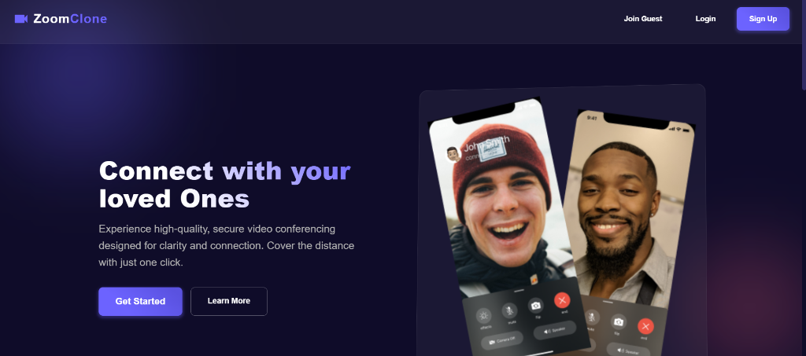

# Zoom Clone

> **Note**: This project is a **Learning Initiative** developed to explore full-stack web development, real-time communication technologies, and modern UI/UX design.

A premium video conferencing application connecting people with high-quality video, secure authentication, and interactive features.



## 🚀 Tech Stack

- **Frontend**:
  - **React.js**: Component-based UI architecture.
  - **Material UI (MUI)**: For accessible and responsive components.
  - **CSS Modules**: Custom styling for the "Dark Glassmorphism" aesthetic.
- **Backend**:
  - **Node.js & Express.js**: Robust REST API architecture.
  - **Socket.io**: Real-time bidirectional event-based communication.
- **Database**:
  - **MongoDB**: NoSQL database for flexible user data management.
- **Core Technology**:
  - **WebRTC**: Enabling peer-to-peer audio and video streaming.

## 🎯 Challenges Faced & Solved

Building this real-time application involved overcoming several complex technical challenges:

1.  **Mesh Network Implementation**:

    - _Challenge_: Managing multiple peer-to-peer connections in a group call without overloading the client.
    - _Solution_: Implemented a robust signaling server using Socket.io to coordinate SDP offers/answers and ICE candidates efficiently.

2.  **Real-Time Synchronization**:

    - _Challenge_: Syncing state changes like "Raise Hand" or "Mute" across all users instantly.
    - _Solution_: Designed a custom socket event system (`meeting-interaction`) to broadcast state deltas with low latency.

3.  **Modern UI Design**:

    - _Challenge_: Moving away from generic Bootstrap/Tailwind looks to create a unique "Dark Glassmorphism" feel.
    - _Solution_: Heavily customized Material UI themes and global CSS to implement backdrop filters, gradients, and floating control docks.

4.  **Device Resource Management**:
    - _Challenge_: Handling camera/microphone locking issues when multiple components try to access media streams.
    - _Solution_: Refactored media permission logic into a centralized handler that requests unified access streams.

## 🛠️ How to Run Locally

Follow these steps to get the application running on your machine.

### Prerequisites

- Node.js (v14+)
- MongoDB (Local or Atlas URL)

### 1. Clone the Repository

```bash
git clone https://github.com/Khushi-Roy-123/Zoom.git
cd Zoom
```

### 2. Backend Setup

Open a terminal and navigate to the backend folder:

```bash
cd backend
npm install
```

- Create a `.env` file (optional, defaults to port 8000 and local mongo) or update `src/app.js` with your MongoDB URL if using Atlas.
- **Start the Server**:
  ```bash
  npm run dev
  ```
  _Server runs on http://localhost:8000_

### 3. Frontend Setup

Open a new terminal and navigate to the frontend folder:

```bash
cd frontend
npm install
```

- **Start the Client**:
  ```bash
  npm start
  ```
  _App opens at http://localhost:3000_

## 🌟 Key Features

- **HD Video & Audio**: Crystal clear peer-to-peer streaming.
- **Interactive Controls**: Raise Hand, Emoji Reactions, and Screen Sharing.
- **Secure Auth**: User registration and login.
- **Premium UI**: Fully responsive dark mode with glassmorphism effects.

---

_Built with ❤️ for learning and community._
